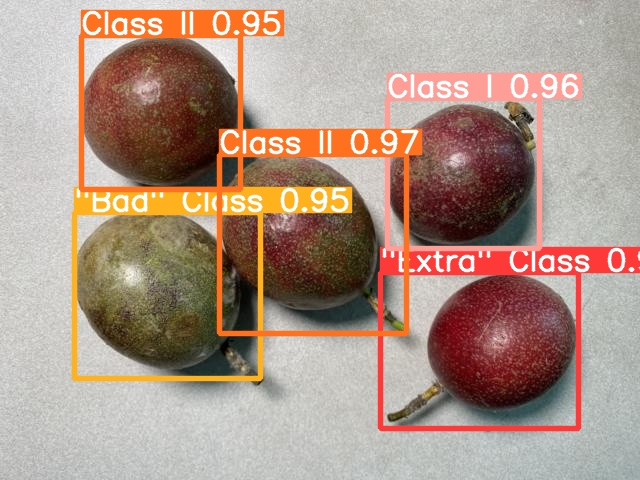

# ATC-YOLOv5-fruit-detection
* Modified YOLOv5 model for fruit detection(based on Ultralytics YOLOv5_v7.0).
* The main modifications collated/introduced are AFPN ( modified), Weighted feature concat (proposed in BiFPN), TRCSP ( modified obtained based on modules in BotNet), Coordinate Attention Mechanism.
* The project was uploaded to github for the first time (previously running on a cloud server), so there may still be some refinements to be made, but its idea is mainly the model structure of ATC-YOLOv5.
* 中文版本的说明将在后续对项目结构进行进一步完善后更新。

# YOLOv5
Except for the changes made when adding the improved modules and modifying the FPN structure, most of the rest of the files are identical to the [original YOLOv5](https://github.com/ultralytics/yolov5) version.

# ATC-YOLOv5
Model file: **yolov5s-AFPN-1-ALL.yaml**

The FPN in the network adopts the structure based on AFPN and adds new feature fusion paths to it, and the new fusion paths adopt Weighted feature concat.

# Training
If you want to use ATC-YOLOv5 for training, please use the file **train-WF.py** (based on the modification of **train.py**, which can output the weight value of each weighted feature concat during training, so that it is convenient to observe the experimental effect. And it can also save all the weight values automatically at the end of training).

Also,please configure your own path and other parameters before training, and the **training operation is similar to the [original YOLOv5](https://github.com/ultralytics/yolov5)**.

# Result
The project was tested on a self-made passion fruit dataset, and other users are welcome to apply it to their own datasets for testing. 
The following are some of the results:

| MAP@0.5/% | F1/% | P/% | R/% | param/M | mean detection time/ms | GFLOPs |
|-----------|------|-----|-----|---------|------------------------|--------|
|  95.36    |89.30 |87.88|90.76|   6.28  |         3.2            |   14.9 |

# Reference
The main references for model modifications are as follows:

https://github.com/leaderj1001/BottleneckTransformers

https://github.com/houqb/CoordAttention

https://github.com/google/automl/tree/master/efficientdet.

https://github.com/gyyang23/AFPN

